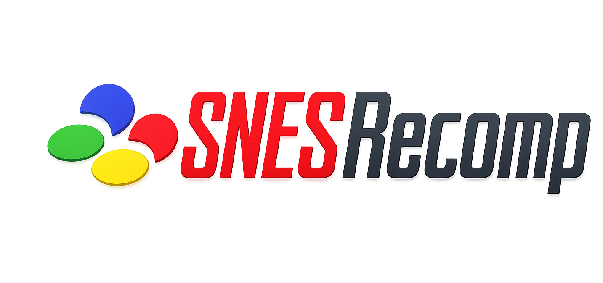

<p align="center">
  
</p>

# snesrecomp

A static recompiler for SNES (Super Famicom) games. Translates 65816
machine code into native C ahead-of-time, so the recompiled game runs
as a normal binary rather than under interpretation.

> ## Status: alpha (v0.1.0), three games at varying playability
>
> **Super Mario World is believed fully playable** through the
> recompiler. **Mega Man X is believed fully playable** end-to-end.
> **A Link to the Past** is playable through the early dungeon. The
> framework itself is still alpha: APIs change without warning and
> internal docs assume active-session context.
> [`v0.1.0`](https://github.com/mstan/snesrecomp/releases/tag/v0.1.0) is
> the first tagged release — a working snapshot that all three games
> build against, not a stability guarantee.

## Per-game runner repos

snesrecomp is the shared framework. Each game lives in its own
companion repo that junctions this checkout as a sibling and supplies
the game-specific runtime, `.cfg`, and build glue.

- **Super Mario World** —
  [mstan/SuperMarioWorldRecomp](https://github.com/mstan/SuperMarioWorldRecomp).
  **Believed playable end-to-end.** Hand-verified from Yoshi's Island
  through the Forest of Illusion and into Star Road (the secret world
  hub); later/special content beyond that not yet hand-verified but
  expected to play similarly. Two always-on runtime tripwires (M/X claim
  verifier and async cpu->m_flag/x_flag-write detector) have not latched
  on the verified worlds.

- **The Legend of Zelda: A Link to the Past** —
  [mstan/ZeldaAlttPSNESRecomp](https://github.com/mstan/ZeldaAlttPSNESRecomp).
  **Playable through early dungeon.** Boot → attract demo → file
  select → overworld → Module 07 (Dungeon) with sword combat is
  hand-verified. Later content not yet hand-verified.

- **Mega Man X** —
  [mstan/MegaManXSNESRecomp](https://github.com/mstan/MegaManXSNESRecomp).
  **Believed playable end-to-end.** Boot → Capcom logo → attract intro
  → title screen → intro stage and the Maverick stages with their
  bosses play through; the earlier lockups (cooperative-scheduler
  stalls, dispatch-site m/x mistranslations) and visual rough edges
  have been resolved.

The intent is for snesrecomp to be **game-agnostic** — adding a new
game should cost mostly per-game `.cfg` work, not months of framework
patching. SMW exercised the framework hard during 2026-04/05 and
surfaced the bug classes the framework now handles permanently:
per-variant exit-(M, X) inference with order-independent fixpoint,
dispatch-terminator JSL recognition, PHP/PLP-bracketed M/X tracking,
wrapper-bypass autorouter, tail-call autorouter, and a full runtime
tripwire suite catalogued in [`docs/TRIPWIRES.md`](docs/TRIPWIRES.md).
LttP and MMX have each surfaced their own framework gaps (LoROM
bank-mirror routing, MMX cooperative-scheduler HLE, abs-indirect
dispatch emit, dispatch-site m/x tracking) that are now baked in.

## Conventions for per-game repos

To keep new games consistent and free of leftover game-specific naming:

- **Window title** (`kWindowTitle` in the game's `src/main.c`):
  `"<Full Game Name> (Recompiled)"` — e.g. `Super Mario World (Recompiled)`,
  `Megaman X (Recompiled)`, `Legend of Zelda: A Link to the Past (Recompiled)`.
- **Config file:** a generic `config.ini` (plus optional `config.user.ini` /
  `config.local.ini`) — not a per-game-named `.ini`.
- **Shared framework hooks** use neutral, game-agnostic names (e.g.
  `RunOneFrameOfGame` / `RunOneFrameOfGame_Internal`, `recomp_post_mortem_dump`) —
  never a game prefix.

## What's in this repo

- `recompiler/` — Python code that decodes 65816 ROM bytes,
  reconstructs control flow, and emits C.
- `runner/` — C runtime that the generated code links against (CPU
  state, memory mapping, debug server, always-on trace rings).
- `tests/` — framework tests (decoder, CFG, SSA placement, etc.) and
  L3 fixtures.
- `fuzz/` — differential fuzzer over synthetic 65816 snippets.
- `tools/` — scripts for regen, trace diffing, etc., plus
  [`tools/snesref/`](tools/snesref/): a standalone SDL2 libretro
  frontend that serves as the hardware-accurate timing/state reference for
  diffing the recompiled build (also published standalone as
  [`mstan/snesref`](https://github.com/mstan/snesref); formerly `mmxref`).

## MSU-1 audio

The runner implements the [MSU-1](https://sneslab.net/wiki/MSU1)
coprocessor (near's spec): the `$2000-$2007` registers, the `.msu` data
channel, and 44.1 kHz stereo PCM track streaming mixed on top of the
S-DSP output. It's a shared runtime feature, so it works for any game.

**Default-OFF and byte-identical** when no pack is present — the `$2000`
range reads back as open bus exactly as before, so non-MSU builds are
unaffected.

**Using it** — point `SNESRECOMP_MSU1` at an MSU pack:

```sh
# A folder: the pack base name is auto-detected from the *-<N>.pcm files
SNESRECOMP_MSU1=/path/to/msu_pack ./game rom.sfc

# …or an explicit base prefix (resolves <prefix>-<N>.pcm + <prefix>.msu)
SNESRECOMP_MSU1=/path/to/msu_pack/alttp_msu ./game rom.sfc
```

A pack is the usual set of `<name>-<N>.pcm` files (each an `MSU1` header +
44.1 kHz signed-16 stereo PCM); header-less raw PCM is also accepted.

**Game side** — the chip is inert until a ROM drives it. Vanilla ROMs
have no MSU-1 driver, so a game must be recompiled from an MSU-1-patched
ROM (e.g. ALttP via qwertymodo's patch + a `bank22.cfg`). See
[`docs/MSU1.md`](docs/MSU1.md) for the full integration write-up.

## Public API / docs

There isn't a public API yet, and there aren't user-facing docs.
Internal docs assume context from active development sessions and
will not make sense without it. This will change once the framework
stabilizes.

## Acknowledgements

snesrecomp did not start from scratch — its runtime and tooling stand on
prior reverse-engineering and emulation work, and we're grateful for it:

- **[snesrev](https://github.com/snesrev)** (`snesrev/zelda3`,
  `snesrev/smw`) — the C runner and surrounding ecosystem were heavily
  based on the snesrev reverse-engineered ports. The "recompile/port the
  CPU code to C, emulate the rest of the silicon, and verify against a
  reference emulator" model is theirs, and concrete pieces were adapted
  directly: the function-boundary conventions consumed by
  `tools/ingest_zelda3_decomp.py`, runtime utilities (`runner/src/util.h`
  still carries the `ZELDA3_UTIL_H_` guard), the SHA-256 ROM-verification
  path, and the default keybind layout.
- The C SNES hardware core under
  [`runner/src/snes/`](runner/src/snes/) (PPU, APU, DSP, SPC700, DMA,
  cart mapping) is derived from the **[LakeSnes](https://github.com/elzo-d/LakeSnes)**
  (elzo-d) C emulator that snesrev's projects vendor, with individual
  algorithms credited inline to **snes9x**.
- **[IsoFrieze/SMWDisX](https://github.com/IsoFrieze/SMWDisX)** — the
  Super Mario World disassembly used as the symbol/RAM-map basis and as
  the conformance oracle for the SMW port (see
  `tools/cfg_override_smwdisx_crosscheck.py`,
  `tests/test_smwdisx_compare.py`). SMWDisX in turn credits mikeyk's
  original 2013 disassembly and loveemu's SPC700 work.

## License

Not yet declared. Code in this repo is original except where noted in
**Acknowledgements** above. The libretro API header
`tools/snesref/libretro.h` is MIT (RetroArch team). The reference tool
(`tools/snesref/`) loads a libretro emulator core as a runtime DLL — no
emulator source or binary is vendored in this repo, so it carries none of
a core's licensing terms; supply a core yourself. The `runner/src/snes/`
hardware core derives from LakeSnes (and, transitively, snes9x); their
respective terms apply to that code.
